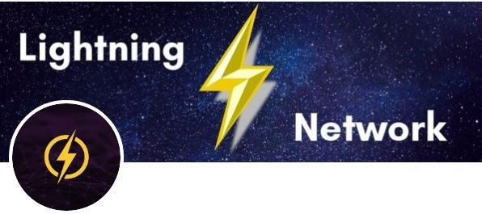

<p>
  	
</p>
# TWITTER LIGHTNING TIPPING BOT - RUN THIS BOT AT YOUR OWN RISK!

### Requirements
1. Umbrel node https://getumbrel.com/ with inbound, and outbound capacity. 
I also recommended that you add your umbrel node IP address x.x.x.x umbrel.local to you local host file.
2. Twitter developer account https://developer.twitter.com/en
3. I recommend you use VPN when running this bot to hide your real IP

### Installation
```
git clone https://github.com/RielBitcoin/Twitter_Bitcoin_Lightning_Tipping_Bot.git
npm install
```

### Configuration
1. Go to supabase.io, create a project and import database importSQL.sql - maybe someone can automate tables creation.
3. Rename config_sample.js to config.js and do the configuration

### Commands
```
!tip 1000 - will tip twitter user 1,000 Sats.
!pay - will pay the QR invoice. 
!donate 1000 - will allow twitter user to donate 1,000 sats to the bot.
!GivePowerOfSatoshi - those to have donated over 10,000 sats can use this to give another twitter user the power to tip. 
```

### Start your bot
```
node startBot.js
```
